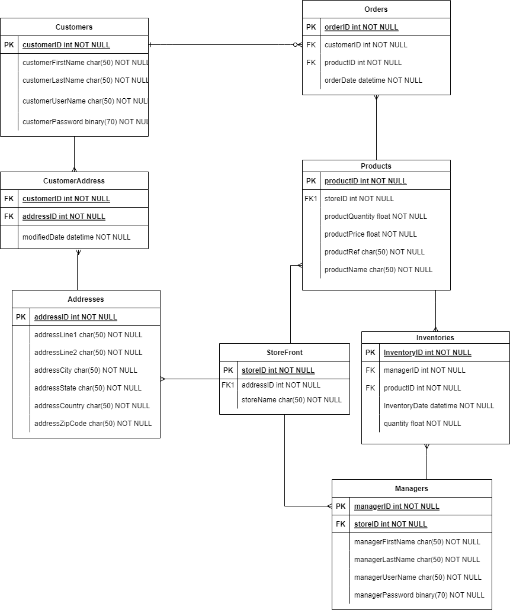
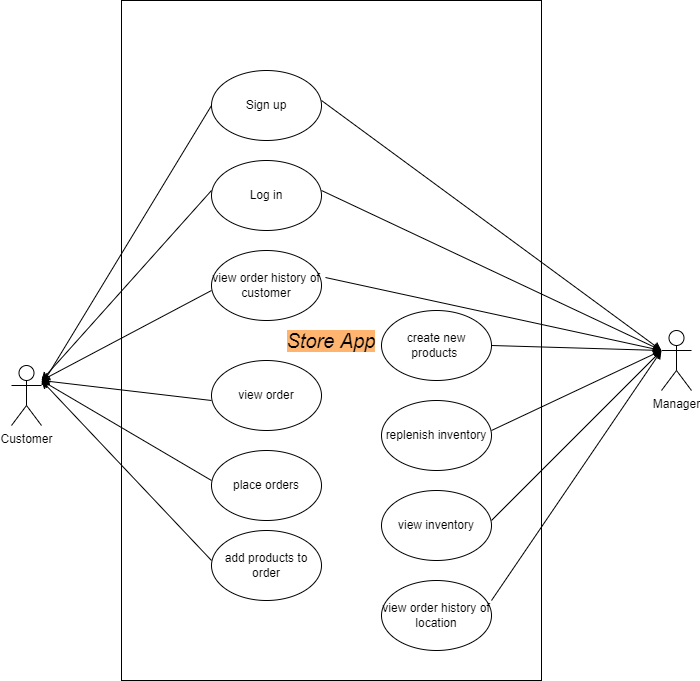

# **Overview**

The store app is a software that helps customers purchase products from your business. Designed with functionality that would make virtual shopping much simpler!

# **Understanding the problems**

# **Project objective**

- add a new customer ("sign up")
- search customers by name("log in")
- view storefront inventory
- place orders to a store for customers
- view order history of customer
- view order history of location
- display details of an order
- replenish inventory

# **Methodologie**
## **Modelisation**
**Entity Diagram**

<<<<<<< HEAD

  ## **Modelisation**
  
    ### **Entity Diagram**
    

    ### **UML Diagram**
    
=======
 **UML Diagram**

 
>>>>>>> 9d85f94f8c94c118ba7ffacf755f22da41668897

  ## **Technologie stack**
    
    - C#
    - Xunit
    - SQLServer DB
    - ADO.NET
    - Serilog or Nlog (or any other logging frameworks)
